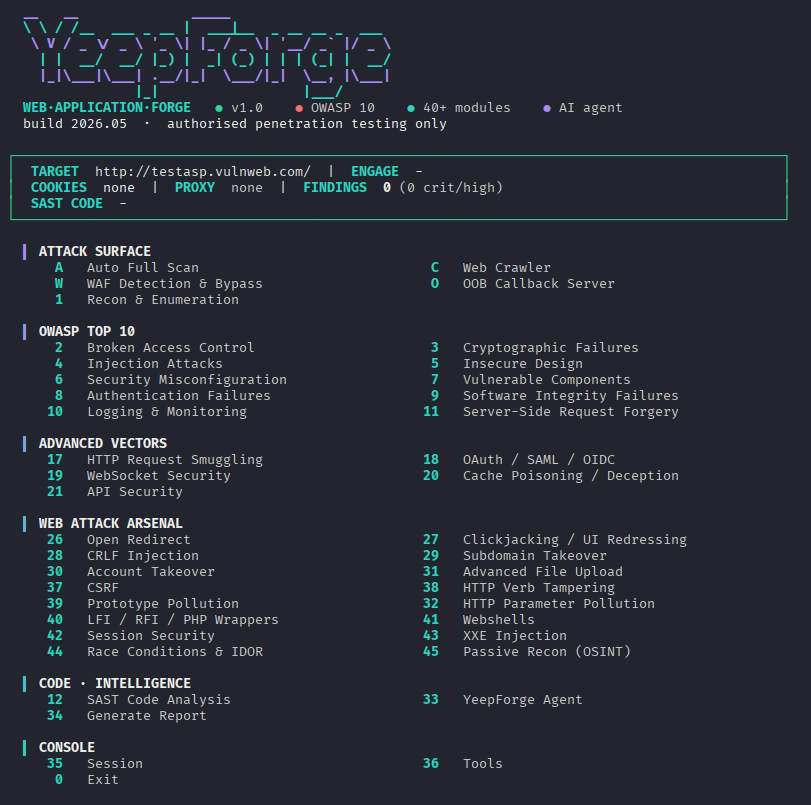

<div align="center">

# YeepForge Agent
### The AI Penetration Tester That Works While You Sleep

**capture0x - powered by tmrswrr**

[](#agent)
[](https://owasp.org/Top10/)
[](#code-analysis)
[](https://python.org)
[](https://ollama.com)
[](LICENSE)

> **Give it a URL. Give it source code. Watch it hack.**



</div>

---

## What Makes YeepForge Different?

Most security tools are menus of commands you run manually.

**YeepForge Agent is different.** It's an AI that *thinks like a penetration tester* - it reads the target, decides what to attack next, chains findings together, and delivers a professional CVSS-scored report. You provide a URL. The Agent does the rest.

```bash
./run.sh --target https://your-target.com
# Select [33] YeepForge Agent → [1] Autonomous Pentest
# Go grab coffee.
```

---

<div align="center">

<a id="agent"></a>
## The Agent

</div>

### How It Thinks

The Agent doesn't run tools randomly. After every result, it analyzes what it found and decides the smartest next move:

```
[ROUND 1] recon_target       → Apache/2.4 + PHP/7.4 + login form detected
             ↓ context: login found
[ROUND 2] test_authentication → Tries default creds: admin:admin → FAILED
             ↓ context: PHP app, has .git?
[ROUND 3] find_sensitive_files→ /.git/config exposed! (Critical)
             ↓ context: /.git exposed = source code leak
[ROUND 4] analyze_source_code → SAST: 3 SQL injections, 2 XSS in source code
             ↓ context: SQLi in /login confirmed in code
[ROUND 5] test_sql_injection  → Dynamic confirm: error-based SQLi at /login
[ROUND 6] report_finding      → CVSS 9.8 - Critical SQL Injection recorded
...
[ROUND N] finish_assessment   → HTML + JSON report generated
```

**One command. Full assessment. Professional report.**

---

### Agent Intelligence - Context-Aware Decision Making

| What the Agent discovers | What it does next |
|--------------------------|-------------------|
| Login form on any page | → Jumps to `test_authentication` immediately |
| WordPress / Drupal / Joomla | → Prioritizes CMS vulnerability scan |
| SQL error in any response | → Escalates `test_sql_injection` |
| `.git` or `.env` exposed | → Flags Critical, digs deeper |
| API endpoints in JS files | → Switches to GraphQL/JSON dir scan |
| WAF blocking requests | → Activates WAF bypass payloads |
| Source code provided | → Runs SAST before dynamic tests |
| SAST finds SQLi in code | → Confirms with dynamic `test_sql_injection` |
| PHP detected | → Prioritizes path traversal + file inclusion |

---

### Agent Modes

```
[1] Autonomous Pentest   - Full tool-use loop. Set target, press enter, get report.
[2] Interactive Chat     - Talk to the AI. Ask questions, get payloads, explore.
[3] Payload Generator    - "Give me 20 SQLi payloads for WAF bypass" → instant list.
[4] Code Analysis (SAST) - Point to source code → 14 AI skills scan every file.
[5] Set Source Code Path - Enable SAST for the autonomous mode.
```

---

### Agent Backends - Free Local or Cloud

| Backend | Cost | Speed | Quality | Setup |
|---------|------|-------|---------|-------|
| **Ollama - mistral** (default) | Free | Fast | Great | `ollama pull mistral` |
| **Ollama - llama3.2:3b** | Free | Fastest | Good | `ollama pull llama3.2:3b` |
| **Ollama - qwen2.5-coder** | Free | Medium | Great | `ollama pull qwen2.5-coder` |
| **Claude API** | Paid | Medium | Excellent | `ANTHROPIC_API_KEY=sk-ant-...` |

**No API key required.** Run entirely offline with Ollama.

```bash
# Free setup - works out of the box
ollama serve
ollama pull mistral
./run.sh  →  [33] Agent  →  [1] Autonomous Pentest
```

### MCP Server - drive YeepForge from Claude Code / Cursor / Claude Desktop

YeepForge also ships as an [MCP](https://modelcontextprotocol.io) server: it
exposes all 28 scan tools (`recon_target`, `crawl_target`, `test_sql_injection`,
`nuclei_scan`, …) plus `set_engagement` over the Model Context Protocol, and a
host that already has an LLM drives the engagement with **its own subscription** -
no `ANTHROPIC_API_KEY`, no local model needed on YeepForge's side. The host is the
brain; YeepForge is the toolbox.

```bash
cd YeepForge && claude          # .mcp.json is auto-loaded; approve "yeepforge"
# then: "set the engagement to https://app.example.com, recon and crawl it,
#        test the params for SQLi/XSS, and write a report"
```

Set the target once with `set_engagement` and YeepForge injects it (plus
cookies/proxy/auth) into every later call. Full setup for Claude Code, Cursor and
Claude Desktop: **[docs/mcp.md](docs/mcp.md)**.

---

### Agent Skills - guided pentest workflows

YeepForge bundles [Claude Agent Skills](https://docs.claude.com/en/docs/claude-code/skills)
under `.claude/skills/`, auto-discovered by Claude Code:

- **`yeepforge-pentest`** - orchestrates a full engagement through the MCP tools:
  authorization gate → recon → crawl → OWASP Top 10 testing → exploit → report.
- **`yeepforge-sast`** - drives source-code analysis (`analyze_source_code`).
- **`security-fuzzing` · `security-payloads` · `security-patterns`** - SecLists
  payload/wordlist/secret-pattern references for manual testing.

The three `security-*` skills are vendored from
[awesome-skills-security](https://github.com/Eyadkelleh/awesome-skills-security)
(MIT, a SecLists redistribution); web-shell samples were excluded on purpose. See
[`.claude/skills/NOTICE.md`](.claude/skills/NOTICE.md) for attribution.

---

<a id="code-analysis"></a>
### SAST Code Analysis - 14 AI Skills

The Agent can analyze source code **alongside** dynamic testing. When you provide a codebase:

1. Agent reads architecture, frameworks, entry points
2. Traces every user input through the code
3. Finds SQLi/XSS/RCE/SSRF/JWT/IDOR in source
4. **Then** confirms findings with dynamic testing
5. Combined report: static + dynamic findings

```
[4] Code Analysis menu:

  ○ [ 1]  Architecture Analysis  - tech stack · entry points · trust boundaries
  ○ [ 2]  SQL Injection          - string concat · ORM raw queries · 2nd order
  ○ [ 3]  Cross-Site Scripting   - HTML/JS sinks · DOM XSS · template injection
  ○ [ 4]  SSRF                   - outbound HTTP · user-controlled destinations
  ○ [ 5]  Remote Code Execution  - eval · exec · deserialization · OS commands
  ○ [ 6]  XXE                    - XML parsers without entity hardening
  ○ [ 7]  File Upload            - extension bypass · webshell upload paths
  ○ [ 8]  Path Traversal         - file reads with user-controlled paths
  ○ [ 9]  SSTI                   - template engines rendering user data
  ○ [10]  JWT Security           - algorithm confusion · missing validation
  ○ [11]  IDOR                   - missing ownership/authorization checks
  ○ [12]  Missing Auth           - unauthenticated sensitive endpoints
  ○ [13]  Business Logic         - price manipulation · workflow bypass
  ○ [14]  GraphQL                - injection · introspection · batching abuse
  ○ [ F]  Full Scan              - all 14 skills + final consolidated report
  ○ [ R]  Generate Report        - consolidate completed skill results
```

---

## Full Feature Set

### Automated Engine
| Key | Module | What it does |
|-----|--------|-------------|
| `[A]` | **Auto Full Scan** | Crawl → test all OWASP → nikto → nuclei → CVSS report |
| `[C]` | **Web Crawler** | Links, forms, JS APIs, robots.txt, sitemap - plus optional headless rendering for SPAs |
| `[W]` | **WAF Bypass** | 14+ WAF fingerprints · 100+ bypass payloads per category |
| `[O]` | **OOB Collaborator** | interactsh-backed callbacks confirming blind SQLi, SSRF, XXE, Log4Shell, CMDi |
| `[33]`| **AI Agent** | Autonomous pentest · chat · payloads · SAST code analysis |

### OWASP Top 10 (2021)
| Category | Module | Coverage |
|----------|--------|---------|
| A01 Broken Access Control | `[2]` | IDOR · path traversal · forced browsing · JWT |
| A02 Cryptographic Failures | `[3]` | Sensitive files · cleartext · weak hashes · JS secrets |
| A03 Injection | `[4]` | SQLi · XSS · SSTI · CMDi · XXE · NoSQL · LDAP |
| A04 Insecure Design | `[5]` | Business logic · race conditions · mass assignment |
| A05 Security Misconfiguration | `[6]` | Headers · CORS · debug endpoints · default creds |
| A06 Vulnerable Components | `[7]` | CVE scan · nikto · CMS scanner · Log4Shell |
| A07 Authentication Failures | `[8]` | Brute force · session · MFA bypass · credential stuffing |
| A08 Integrity Failures | `[9]` | Deserialization · SRI · CI/CD exposure |
| A09 Logging Failures | `[10]` | Log injection · stack trace exposure · lockout testing |
| A10 SSRF | `[11]` | Internal ports · cloud metadata · gopher · blind OOB |

### Advanced Exploitation
| Module | Techniques |
|--------|-----------|
| `[17]` HTTP Request Smuggling | CL.TE · TE.CL · TE obfuscation · H2.TE downgrade |
| `[18]` OAuth / SAML / OIDC | Redirect URI bypass · state CSRF · SAML XSW/XXE/replay |
| `[19]` WebSocket Security | CSWSH · message injection · origin bypass |
| `[20]` Cache Poisoning | Unkeyed headers · fat GET · cache deception · DoS |
| `[21]` API Security | GraphQL introspection · batch abuse · REST enumeration |

### Web Application Attacks
| Module | Techniques |
|--------|-----------|
| `[26]` Open Redirect | 17 bypass variants · scheme abuse · ATO chain |
| `[27]` Clickjacking | Frame detection · PoC generator · sandbox bypass |
| `[28]` CRLF Injection | Header injection · response splitting · log injection |
| `[29]` Subdomain Takeover | 25 service fingerprints · CNAME hijacking · nuclei |
| `[30]` Account Takeover | Password reset · email change · 2FA bypass |
| `[31]` Advanced File Upload | Polyglot · SVG XSS · ZIP slip · ImageMagick |
| `[32]` HTTP Parameter Pollution | WAF bypass · business logic · DOM HPP |
| `[37]` CSRF | Token detection · bypass · PoC generator · SameSite |
| `[38]` HTTP Verb Tampering | PUT/DELETE/TRACE · XST · method override |
| `[39]` Prototype Pollution | JS `__proto__` · PHP type juggling · XPath · email injection |
| `[40]` LFI / RFI / PHP Wrappers | Local/remote inclusion · log poisoning · `php://` filters |
| `[41]` Webshells | Generate · upload · interact · obfuscate · reverse shell |
| `[42]` Session Security | Cookie attributes · fixation · timeout · logout · cache |
| `[43]` XXE Injection | Classic · blind OOB · billion laughs · SSRF via XXE |
| `[44]` Race Conditions & IDOR | TOCTOU · limit-overrun · IDOR automation · business logic |
| `[45]` Passive Recon (OSINT) | DNS · Google dorks · GitHub leaks · Shodan · certs - zero target traffic |

---

## Quick Start

### 1. Install

```bash
git clone https://github.com/capture0x/YeepForge
cd YeepForge
chmod +x install.sh run.sh
./install.sh
```

### 2. Start Ollama (free AI backend)

```bash
ollama serve &
ollama pull mistral        # Best instruction following
# or
ollama pull llama3.2:3b   # Fastest
```

### 3. Launch Agent

```bash
./run.sh

# Session Setup:
#   Target URL: https://target.example.com

# Main menu → [33] YeepForge Agent → [1] Autonomous Pentest
# Watch the AI work. Get a report.
```

### Agent + SAST (when you have source code)

```bash
./run.sh

# Main menu → [33] YeepForge Agent
#   [5] Set Source Code Path → /path/to/app/source
#   [1] Autonomous Pentest   → runs dynamic + SAST combined
# or:
#   [4] Code Analysis (SAST) → select individual skills
```

---

## Reports

Every assessment produces a professional report:

```
CONFIDENTIAL - WEB APPLICATION PENETRATION TEST REPORT

┌─ Overall Risk: CRITICAL (CVSS 9.8) ─────────────────────────┐
│  Critical: 2  High: 5  Medium: 8  Low: 3  Total: 18          │
└──────────────────────────────────────────────────────────────┘

Executive Summary ........ auto-generated narrative
Findings Overview ........ sortable table with CVSS v3.1 scores
Detailed Findings ........ cards with: severity · CVSS · OWASP · remediation
OWASP Top 10 Coverage .... visual grid - tested vs not tested
Remediation Priority ..... P1 (24h) / P2 (7d) / P3 (30d) / P4 (quarterly)
```

**Formats:** HTML (print-ready) · Markdown · JSON (CI/CD ready)

```bash
[34] Generate Report → [4] All formats
# → reports/yeepforge_report_20260521_143022.html
```

---

## Installation & Requirements

### Dependencies

```bash
# Python
pip install anthropic requests   # LLM backends + Ollama HTTP

# Headless crawling (optional, ~150MB - needed to see a SPA's attack surface)
pip install playwright && playwright install chromium

# APT security tools
apt install nmap nikto sqlmap gobuster ffuf hydra hashcat \
            wpscan feroxbuster wafw00f whatweb masscan dirb

# Go tools (optional but recommended)
go install github.com/projectdiscovery/subfinder/v2/cmd/subfinder@latest
go install github.com/hahwul/dalfox/v2@latest
go install github.com/projectdiscovery/nuclei/v3/cmd/nuclei@latest
```

### AI Backend Setup

```bash
# Ollama (recommended - free, local, no key needed)
curl -fsSL https://ollama.com/install.sh | sh
ollama pull mistral              # Best for pentesting
ollama pull llama3.2:3b          # Fastest option
ollama pull qwen2.5-coder:7b     # Best for code analysis

# Claude API (optional - better quality, requires key)
export ANTHROPIC_API_KEY=sk-ant-...
# or add to .env: ANTHROPIC_API_KEY=sk-ant-...
```

### Configuration (`.env`)

```env
TARGET_URL=https://target.example.com
ENGAGEMENT_NAME=Q4-2026-Pentest
COOKIES=sessionid=abc123; csrftoken=xyz
AUTH_TOKEN=Bearer eyJhbGci...
PROXY=http://127.0.0.1:8080
ANTHROPIC_API_KEY=              # Leave empty to use Ollama
YEEPFORGE_OPSEC=normal          # loud / normal / stealth
```

---

## Module Reference

```
AUTOMATED
  [A] Auto Full Scan    [C] Web Crawler
  [W] WAF Bypass        [O] OOB Collaborator

OWASP TOP 10
  [1]  Recon            [2]  Broken Access Control
  [3]  Crypto Failures  [4]  Injection
  [5]  Insecure Design  [6]  Security Misconfig
  [7]  Vuln Components  [8]  Auth Failures
  [9]  Integrity        [10] Logging
  [11] SSRF             [12] SAST Code Analysis (AI)

ADVANCED EXPLOITATION
  [17] HTTP Smuggling   [18] OAuth/SAML/OIDC
  [19] WebSocket        [20] Cache Poisoning
  [21] API Security

WEB APPLICATION ATTACKS
  [26] Open Redirect    [27] Clickjacking
  [28] CRLF Injection   [29] Subdomain Takeover
  [30] Account Takeover [31] File Upload (Advanced)
  [32] HTTP Param Poll. [37] CSRF
  [38] Verb Tampering   [39] Prototype Pollution
  [40] LFI / RFI        [41] Webshells
  [42] Session Security [43] XXE Injection
  [44] Race / IDOR      [45] Passive Recon (OSINT)

AI AGENT
  [33] YeepForge Agent  ← START HERE
       [1] Autonomous Pentest
       [2] Interactive Chat
       [3] Payload Generator
       [4] Code Analysis (SAST)
       [5] Set Code Path

UTILITIES
  [34] Generate Report  [35] Session Manager
  [36] Tool Checker
```

---

## Architecture

```
YeepForge/
├── main.py                      # Entry point, menu router
├── modules/
│   ├── agent/                   ← The Brain
│   │   ├── _core.py             # 27 tools, smart routing, SAST integration
│   │   ├── backends.py          # Ollama (mistral/llama/qwen) + Claude adapters
│   │   ├── constants.py         # Model config, timeout, OPSEC settings
│   │   └── logger.py            # Live markdown report writer
│   ├── auto_scanner.py          # Automated OWASP orchestrator
│   ├── crawler.py               # Smart web crawler (links/forms/JS/APIs)
│   ├── waf_bypass.py            # WAF fingerprint + 100+ bypass payloads
│   ├── oob_server.py            # OOB HTTP listener (blind vuln detection)
│   ├── sast_skills/             # 14 analysis skills + report generator (SKILL.md)
│   └── [attack modules]         # Full OWASP + Advanced + Web App coverage
├── reports/                     # HTML/MD/JSON professional reports
└── output/                      # Scan results, agent logs, crawl data
```

---

## CLI Reference

```bash
./run.sh [OPTIONS]

  --target URL       Set target URL directly
  --module KEY       Run module by key (A, C, W, O, 1-45, 33...)
  --session PATH     Load saved session
  --scope PATTERNS   In-scope hosts: '*.example.com,!admin.example.com'
  --proxy URL        Route every request through Burp/ZAP
  --rps N            Cap requests per second (default 10, 0 = unlimited)
  --scope-audit      Warn on out-of-scope requests instead of blocking
  --browser          Render pages in headless Chromium (see a SPA's surface)
  --no-browser       Parse served HTML only; never launch a browser
  --no-banner        Skip ASCII banner
  --list-modules     Print every menu key with its module path and exit
  --non-interactive  Never block on a prompt; use with --module for automation

# Examples
./run.sh --target https://example.com
./run.sh --target https://example.com --scope '*.example.com,!admin.example.com'
./run.sh --target https://example.com --proxy http://127.0.0.1:8080 --rps 4
./run.sh --module 33          # Launch AI Agent directly
./run.sh --module A           # Auto full scan
./run.sh --module 34          # Generate report

# Agent chat commands
/quit               Exit chat
/model mistral      Switch Ollama model
/findings           Show current findings
/context            Show session context
/auto               Toggle auto-execution of CMD suggestions
```

---

## Engagement Safety - scope, rate limiting, evidence

Every request made through the engine in `utils/http.py` is:

- **Scope-checked** - out-of-scope hosts are blocked before the request leaves
  your machine. With no explicit `--scope`, the target host and its subdomains
  are the scope, so a scan cannot wander onto someone else's asset.
- **Rate-limited** - a shared budget across the whole run (`--rps`, default 10),
  with `Retry-After` honoured. This is what keeps you off a program's ban list.
- **Proxied** - `--proxy` applies to every request, so Burp's history is the
  complete engagement record.
- **Recorded** - each finding can carry the raw request/response that proves it
  plus a `curl` reproduction line, rendered into the HTML and Markdown reports.
  Findings also carry a confidence level (`Confirmed` / `Firm` / `Tentative`).

```bash
./run.sh --target https://example.com \
         --scope '*.example.com,!admin.example.com' \
         --proxy http://127.0.0.1:8080 --rps 4
```

See [docs/engine.md](docs/engine.md) for the full configuration reference and
for how to write a module against the client.

---

## Ethical Use & Legal

YeepForge is built for:
- Authorized penetration testing engagements
- Bug bounty programs (in-scope targets only)
- CTF competitions
- Security research (your own systems)
- Learning and education

**Never test systems without explicit written authorization.**

The author assumes no liability for misuse. By using YeepForge, you confirm you have proper authorization for all targets.

YeepForge runs attacker-controlled data on your machine - see
[SECURITY.md](SECURITY.md) for the tool's own security posture, how to run it
safely, and how to report a vulnerability in YeepForge itself.

---

## Contributing

Pull requests are welcome. [CONTRIBUTING.md](CONTRIBUTING.md) covers the dev
setup, how to add a module, and the two non-negotiable rules: all HTTP goes
through `utils/http.py`, and no value is ever interpolated into a shell string.

---

<div align="center">

**YeepForge v1.0 - Agent-First Web Security**

*[capture0x](https://github.com/capture0x) - powered by tmrswrr*

`./run.sh → [33] YeepForge Agent → The AI does the rest.`

</div>
